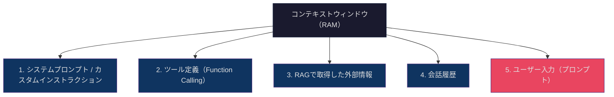
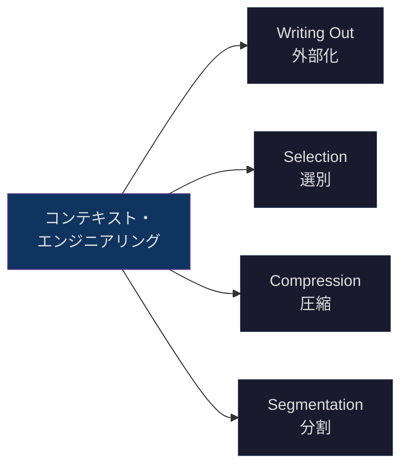

## はじめに

プロンプトを何度書き直しても、AIの出力が期待どおりになりません。この問題の原因は、プロンプトそのものではなく「AIに渡している情報環境全体」にあるかもしれません。

本記事では、この情報環境を戦略的に設計する手法である**コンテキスト・エンジニアリング（Context Engineering）**を体系的に解説します。

- **対象読者**: LLMやAIコーディングツールの利用経験がある中級開発者
- **前提知識**: ChatGPTやClaude等のLLMを日常的に利用している、プロンプトの基本的な書き方を知っている
- **ゴール**: コンテキスト設計の4つのコアテクニックを理解し、自分のプロジェクトで実践できるようになること

## コンテキスト・エンジニアリングとは

コンテキスト・エンジニアリングとは、**LLMが参照する全情報環境を戦略的に設計する技術**です。

Andrej Karpathyはこの概念を次のように表現しています。

> LLMはCPUであり、コンテキストウィンドウはRAMである。

つまり、LLMの性能（CPU）がどれほど高くても、渡す情報（RAM）の質が低ければ出力の質も低くなります。プロンプトの文面を改善するだけではなく、AIが参照する情報全体を設計対象とする考え方がコンテキスト・エンジニアリングです。

### プロンプトエンジニアリングとの違い

| 観点 | プロンプトエンジニアリング | コンテキスト・エンジニアリング |
|------|--------------------------|-------------------------------|
| 対象 | ユーザーの入力テキスト | コンテキストウィンドウ全体 |
| 目的 | 単一の指示を最適化する | 情報環境全体を設計する |
| 手法 | 表現の工夫、Few-shot例示 | 情報の選別・構造化・外部化 |
| スコープ | 1回のやり取り | プロジェクト全体・継続的な運用 |
| 比喩 | 「質問の仕方を工夫する」 | 「作業机の上を整理する」 |

プロンプトエンジニアリングはコンテキスト・エンジニアリングの一部です。プロンプトだけでなく、システムプロンプト、ツール定義、RAGで取得した外部情報、会話履歴まで含めた全体を設計対象として扱います。

## コンテキストウィンドウの構成要素

LLMのコンテキストウィンドウに含まれる情報は、大きく5つの層に分類できます。



各層の役割は以下のとおりです。

| 層 | 役割 | 例 |
|----|------|-----|
| システムプロンプト | AIの振る舞い・制約を定義 | 「あなたはTypeScriptの専門家です」 |
| ツール定義 | AIが利用できる機能を宣言 | ファイル読み書き、Web検索、DB操作 |
| RAG取得情報 | 外部データベースやドキュメントから検索した情報 | 社内ドキュメント、APIリファレンス |
| 会話履歴 | 過去のやり取りの蓄積 | 直前の質問と回答、修正依頼 |
| ユーザー入力 | 今回のリクエスト | プロンプト本文 |

### トークン配分の考え方

コンテキストウィンドウには上限があります。すべての情報を詰め込むのではなく、**各層のトークン配分を意識する**ことが重要です。

:::message
たとえばGPT-4oの128Kトークンのうち、システムプロンプトに数千トークン、ツール定義に数千トークンが消費されると、ユーザーが使える実質的な容量は想像より小さくなります。コンテキストウィンドウは「有限のRAM」であることを常に意識してください。
:::

## 4つのコアテクニック

コンテキスト・エンジニアリングの実践は、以下の4つのテクニックに整理できます。



### 1. Writing Out（外部化）

情報をコンテキストの外部に保存し、必要なときに読み込む手法です。

**課題**: 長時間の会話でコンテキストが膨張し、重要な情報が埋もれる
**解決策**: 重要な情報をファイルやメモリに書き出し、必要時に参照する

具体例:

- **CLAUDE.md**: プロジェクトの規約やアーキテクチャ情報をファイルに記述し、AIエージェントが毎回自動で読み込む
- **メモリ機能**: ChatGPTのMemoryやClaude Codeのメモリシステムで、ユーザーの好みやプロジェクト情報を永続化する
- **ナレッジベース**: 社内ドキュメントをベクトルDBに格納し、RAGで必要な箇所だけ取得する

### 2. Selection（選別）

コンテキストに含める情報を取捨選択する手法です。

**課題**: 関連情報をすべて渡すとノイズが増え、出力精度が低下する
**解決策**: タスクに必要な情報だけを厳選して渡す

具体例:

- **RAGのチューニング**: 検索クエリを最適化し、関連度の高いチャンクだけを取得する
- **ファイル選択**: コードレビューを依頼する際、リポジトリ全体ではなく変更差分と関連ファイルだけを渡す
- **会話履歴の管理**: 古い会話を要約してから渡す、または直近N件に絞る

:::message
「情報は多ければ多いほど良い」は誤りです。LLMは大量のコンテキストの中で情報が分散すると、重要な指示を見落とす傾向があります（Lost in the Middleの問題）。必要十分な情報量を見極めることが、コンテキスト設計の核心です。
:::

### 3. Compression（圧縮）

同じ情報をより少ないトークンで表現する手法です。

**課題**: トークン上限のため、伝えたい情報をすべて含められない
**解決策**: 情報密度を高め、少ないトークンで多くの情報を伝える

具体例:

- **構造化データの活用**: 自然言語の長い説明をJSON/YAML/表形式に変換する
- **要約**: 長いドキュメントをLLMで事前に要約してから渡す
- **テンプレート化**: 毎回の指示を定型化し、変数部分だけを差し替える

```markdown
<!-- 悪い例: 冗長な自然言語 -->
このプロジェクトではTypeScriptを使っています。
バージョンは5.7です。
パッケージマネージャーはpnpmを使っています。
テストにはVitestを使っています。
リンターはBiomeを使っています。

<!-- 良い例: 構造化して圧縮 -->
## 技術スタック
- 言語: TypeScript 5.7
- パッケージマネージャー: pnpm
- テスト: Vitest
- リンター: Biome
```

### 4. Segmentation（分割）

大きな問題を小さなタスクに分割し、各タスクに最適なコンテキストを構築する手法です。

**課題**: 複雑なタスクを1回のプロンプトで処理しようとすると精度が下がる
**解決策**: タスクを分割し、各ステップに必要なコンテキストだけを渡す

具体例:

- **マルチエージェント構成**: 企画・執筆・レビューを別々のエージェントに担当させ、各エージェントに専用のシステムプロンプトとツールを与える
- **パイプライン処理**: 「コード生成 → テスト実行 → エラー修正」を段階的に実行し、各段階で前のステップの出力だけを渡す
- **サブタスク分割**: 「このアプリを作って」ではなく「まずDB設計を提案して」「次にAPIエンドポイントを実装して」と段階的に依頼する

## 実践: プロジェクト設定ファイルによるコンテキスト構築

コンテキスト・エンジニアリングを最も手軽に実践できるのが、AIコーディングツールのプロジェクト設定ファイルです。これらのファイルは、AIがコードを読み書きする際に自動的にコンテキストとして読み込まれます。

### CLAUDE.md（Claude Code）

Claude Codeが自動的に読み込むプロジェクト設定ファイルです。

```markdown:CLAUDE.md
# プロジェクト概要
ECサイトのバックエンドAPI。注文処理と在庫管理を担当する。

## 技術スタック
- 言語: TypeScript 5.7
- ランタイム: Node.js 22
- フレームワーク: Hono
- DB: PostgreSQL 16 + Drizzle ORM
- テスト: Vitest

## コーディング規約
- エラーハンドリングはResult型パターンを使用する（throw禁止）
- ビジネスロジックはdomain/配下に配置する
- APIレスポンスは必ずzodスキーマでバリデーションする

## テスト方針
- ユニットテストはdomain層に集中させる
- APIテストはsupertest + テストDBで実行する
- `pnpm test` で全テスト実行
```

### Cursor Rules（.cursor/rules/）

Cursorが参照するルールファイルです。`.cursor/rules/` ディレクトリに `.mdc` 形式で配置します。

```markdown:.cursor/rules/coding-standards.mdc
---
description: コーディング規約
globs: "src/**/*.ts"
---

# TypeScript コーディング規約

- 型定義はinterfaceではなくtypeを使用する
- 関数はarrow functionで統一する
- anyの使用は禁止。unknownを使い、型ガードで絞り込む
- importはエイリアスパス（@/）を使用する
```

### .github/copilot-instructions.md（GitHub Copilot）

GitHub Copilotがリポジトリ全体のコンテキストとして読み込むファイルです。

```markdown:.github/copilot-instructions.md
# Copilot Instructions

このリポジトリはReact + TypeScriptのSPAです。

## 規約
- コンポーネントはfunction宣言で定義する（アロー関数不可）
- スタイリングはTailwind CSSを使用する（CSS Modulesは不使用）
- 状態管理はZustandを使用する
- データフェッチはTanStack Queryを使用する

## テスト
- テストファイルは`__tests__/`ディレクトリに配置する
- Testing Libraryを使用し、実装詳細ではなくユーザー行動をテストする
```

### 設定ファイルの比較

| 項目 | CLAUDE.md | Cursor Rules | copilot-instructions.md |
|------|-----------|--------------|------------------------|
| ツール | Claude Code | Cursor | GitHub Copilot |
| 配置場所 | プロジェクトルート | `.cursor/rules/*.mdc` | `.github/` |
| 形式 | Markdown | MDC（frontmatter付きMD） | Markdown |
| スコープ指定 | ディレクトリ階層で制御 | `globs` でファイルパターン指定 | リポジトリ全体 |
| 自動読み込み | プロジェクト開始時 | 対象ファイル編集時 | Copilot利用時 |

:::message
これらの設定ファイルは「コンテキストの外部化（Writing Out）」の実践そのものです。プロジェクトの規約やアーキテクチャを毎回プロンプトに書く代わりに、ファイルに記述しておくことでAIが自動的に参照します。
:::

## コンテキスト設計のベストプラクティス

### 1. コンテキストの鮮度を保つ

古い情報がコンテキストに残っていると、AIが誤った前提で回答します。定期的に設定ファイルを見直し、現在のプロジェクト状態と一致しているか確認してください。

- 非推奨になったライブラリの記述を削除する
- バージョン情報を最新に保つ
- 廃止されたコーディング規約を削除する

### 2. 構造化された形式で情報を与える

自然言語の長文よりも、箇条書き・表・JSON/YAMLのほうがLLMは正確に解釈します。

- 技術スタックは表形式で記述する
- ディレクトリ構成はツリー形式で記述する
- ルールは箇条書きで「する / しない」を明確にする

### 3. 役割・制約・出力形式を明示する

AIに「何をすべきか」だけでなく「何をすべきでないか」「どの形式で出力すべきか」を明示すると、出力のブレが大幅に減ります。

### 4. フィードバックループで改善する

コンテキスト設計は一度で完成しません。以下のサイクルで継続的に改善してください。

1. 設定ファイルを作成する
2. AIに作業を依頼する
3. 出力が期待と異なる箇所を特定する
4. 原因がコンテキストの不足・過多・不正確のいずれかを判断する
5. 設定ファイルを修正する

## まとめ

コンテキスト・エンジニアリングの要点を整理します。

- **定義**: LLMが参照する全情報環境を戦略的に設計する技術
- **4つのコアテクニック**: Writing Out（外部化）、Selection（選別）、Compression（圧縮）、Segmentation（分割）
- **実践の第一歩**: CLAUDE.mdやCursor Rulesなどのプロジェクト設定ファイルでコンテキストを外部化する
- **継続的改善**: フィードバックループでコンテキストの精度を高めていく

「プロンプトの書き方を改善する」から「AIに渡す情報環境全体を設計する」へ。この視点の転換が、AI活用の精度を大きく引き上げます。

## 参考リンク

- [Andrej Karpathy — Context Engineering（X）](https://x.com/karpathy/status/1937902205765607626)
- [Simon Willison — Context engineering](https://simonwillison.net/2025/jun/27/context-engineering/)
- [Claude Code — CLAUDE.md ドキュメント](https://docs.anthropic.com/en/docs/claude-code)
- [Cursor — Rules for AI](https://docs.cursor.com/context/rules-for-ai)
