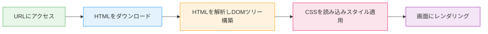
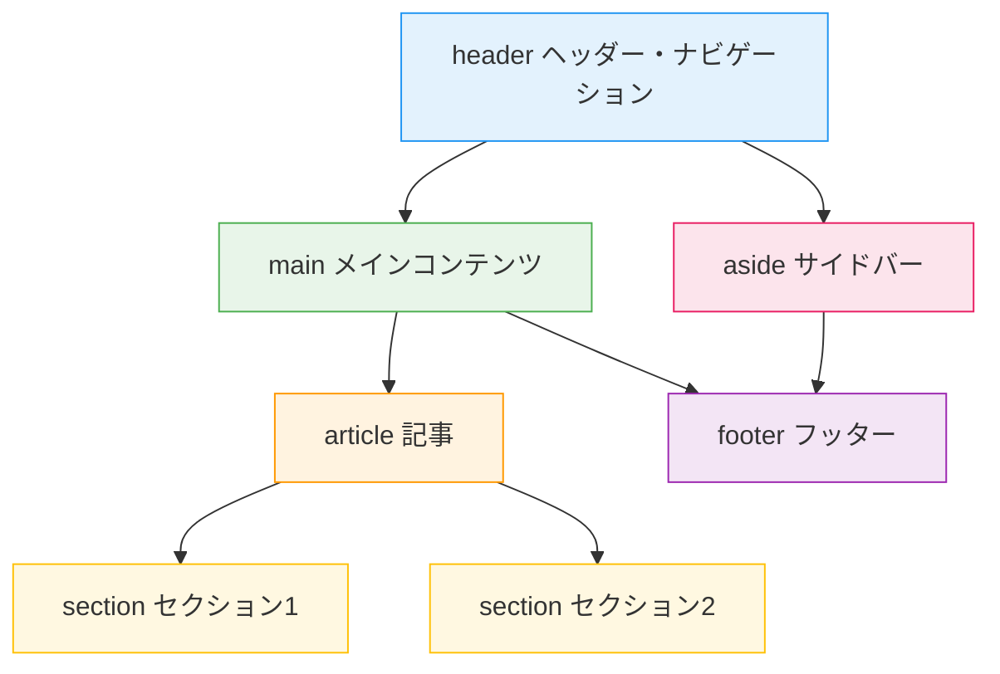

## はじめに

「HTMLのタグはなんとなく知っているけど、正しい使い分けがわからない」
「`<div>` ばかり使ってしまう」
「最近のHTMLに新しい要素が増えたらしいけど、キャッチアップできていない」

そんな悩みを持つ方に向けて、この記事ではHTMLの**基本構造**、**よく使うタグ**、**セマンティクス（意味のあるマークアップ）** の考え方を体系的に解説します。さらに、2026年時点で実用段階に入った新しいHTML要素・属性も紹介します。

### この記事で学べること

- HTMLファイルの基本構造と各パーツの役割
- 実務でよく使う基本タグ20選（コード例付き）
- セマンティックHTMLの考え方と使い分け
- 2026年に知っておきたい新要素（`<dialog>`, `<search>`, `popover` など）

### 対象読者

- プログラミングをこれから学ぶ初学者
- HTMLを断片的に覚えていて、体系的に学び直したい方
- Web制作・フロントエンド開発に興味がある方

### 前提知識

- テキストエディタ（VS Code など）とブラウザがあればOK
- プログラミング経験は不要

## HTMLとは何か — Webページの骨格を理解する

**HTML（HyperText Markup Language）** は、Webページの**構造**を定義するための言語です。

Webページは大きく3つの技術で構成されています。

| 技術 | 役割 | 例え |
|------|------|------|
| **HTML** | 構造（何があるか） | 家の骨組み |
| **CSS** | 見た目（どう見えるか） | 壁紙・ペンキ |
| **JavaScript** | 動き（どう動くか） | 家電・スイッチ |

HTMLはこの中で最も基礎にあたる技術で、「見出し」「段落」「画像」「リンク」といった**ページの構成要素を定義する**役割を担います。

### HTMLファイルの基本構造

すべてのHTMLファイルは、以下の骨格を持っています。

```html:index.html
<!DOCTYPE html>
<html lang="ja">
<head>
  <meta charset="UTF-8">
  <meta name="viewport" content="width=device-width, initial-scale=1.0">
  <title>ページのタイトル</title>
</head>
<body>
  <h1>こんにちは、HTML！</h1>
  <p>ここに本文が入ります。</p>
</body>
</html>
```

各パーツの役割を整理します。

| 要素 | 役割 |
|------|------|
| `<!DOCTYPE html>` | 「これはHTMLの文書です」とブラウザに宣言する[^1] |
| `<html lang="ja">` | HTML文書全体のルート要素。`lang` で言語を指定 |
| `<head>` | メタ情報（文字コード、タイトル、CSS読み込みなど）を記述する領域 |
| `<body>` | 画面に表示されるコンテンツを記述する領域 |

[^1]: 現在のHTMLの正式名称は「HTML Living Standard」ですが、慣習的に「HTML5」と呼ばれることも多いです。

:::note info
`<head>` の中身はブラウザの画面には直接表示されませんが、文字化け防止（`charset`）やスマホ対応（`viewport`）など、重要な設定が入っています。
:::

### 【図解】ブラウザがHTMLを表示するまでの流れ



| ステップ | 処理内容 | 説明 |
|---------|---------|------|
| 1 | HTMLをダウンロード | URLにアクセスすると、サーバーからHTMLファイルが送られてくる |
| 2 | DOM ツリーを構築 | ブラウザがHTMLのタグを上から順に読み取り、ツリー構造のデータに変換する |
| 3 | CSSを適用 | `<head>` 内で指定されたCSSを読み込み、各要素の見た目を決定する |
| 4 | レンダリング | 構造（DOM）と見た目（CSS）を組み合わせて、画面に描画する |

:::note info
**DOM（ドム）** とは、HTMLの構造をツリー状のデータとしてブラウザが内部的に保持するモデルのことです。JavaScriptで要素を操作する際にも、このDOMを通じてアクセスします。
:::

## 基本タグを覚えよう — よく使うタグ20選

HTMLの全体像がつかめたところで、次は実際によく使うタグを見ていきましょう。ここでは、実務で頻繁に使う基本タグをカテゴリ別に紹介します。

:::note info
**コードの試し方**: 以下のコード例は `<body>` 内に書くスニペット（部品）です。試すときは、先ほどの「HTMLファイルの基本構造」の `<body>` 〜 `</body>` の中にコピー＆ペーストして、ファイルをブラウザで開いてください。
:::

### 見出し — `<h1>` 〜 `<h6>`

見出しには1〜6のレベルがあり、数字が小さいほど重要度が高くなります。

```html
<h1>大見出し（ページに1つ）</h1>
<h2>中見出し</h2>
<h3>小見出し</h3>
```

:::note warn
`<h1>` は1ページにつき原則1つだけ使います。SEOやアクセシビリティの観点で、見出しレベルは飛ばさず順番に使いましょう（`<h1>` → `<h3>` のように飛ばさない）。
:::

### 段落・テキスト — `<p>`, `<strong>`, `<em>`, `<br>`

```html
<p>これは段落です。文章のまとまりを <strong>太字で強調</strong> したり、
<em>斜体で強調</em> できます。</p>
<p>改行したい場合は<br>このように書きます。</p>
```

| タグ | 意味 | 表示 |
|------|------|------|
| `<p>` | 段落（Paragraph） | ブロック要素として表示 |
| `<strong>` | 重要な内容（強い強調） | **太字** |
| `<em>` | 強調（Emphasis） | *斜体* |
| `<br>` | 改行（Break） | 行を折り返す |

### リスト — `<ul>`, `<ol>`, `<li>`

```html
<!-- 順序なしリスト（箇条書き） -->
<ul>
  <li>HTML</li>
  <li>CSS</li>
  <li>JavaScript</li>
</ul>

<!-- 順序ありリスト（番号付き） -->
<ol>
  <li>HTMLで構造を作る</li>
  <li>CSSで見た目を整える</li>
  <li>JavaScriptで動きをつける</li>
</ol>
```

| タグ | 意味 | 特徴 |
|------|------|------|
| `<ul>` | 順序なしリスト（Unordered List） | 箇条書き。項目の順番に意味がない場合に使う |
| `<ol>` | 順序ありリスト（Ordered List） | 番号付き。手順など順番に意味がある場合に使う |
| `<li>` | リスト項目（List Item） | `<ul>` または `<ol>` の中に記述する |

### リンクと画像 — `<a>`, ``

```html
<!-- リンク -->
<a href="https://developer.mozilla.org/ja/" target="_blank" rel="noopener noreferrer">
  MDN Web Docs
</a>

<!-- 画像 -->

```

:::note info
`` タグの `alt` 属性は必須です。画像が読み込めなかった場合の代替テキストとして表示されるほか、スクリーンリーダー（読み上げソフト）がこの内容を読み上げるため、**アクセシビリティの観点で非常に重要**です。
:::

### テーブル — `<table>`, `<tr>`, `<td>`, `<th>`

```html
<table>
  <thead>
    <tr>
      <th>言語</th>
      <th>役割</th>
    </tr>
  </thead>
  <tbody>
    <tr>
      <td>HTML</td>
      <td>構造</td>
    </tr>
    <tr>
      <td>CSS</td>
      <td>見た目</td>
    </tr>
  </tbody>
</table>
```

| タグ | 意味 |
|------|------|
| `<table>` | テーブル全体 |
| `<thead>` / `<tbody>` | ヘッダー部 / ボディ部 |
| `<tr>` | 行（Table Row） |
| `<th>` | 見出しセル（Table Header） |
| `<td>` | データセル（Table Data） |

### フォーム — `<form>`, `<input>`, `<button>`, `<label>`

```html
<form action="/submit" method="post">
  <label for="name">名前：</label>
  <input type="text" id="name" name="name" placeholder="山田太郎">

  <label for="email">メール：</label>
  <input type="email" id="email" name="email" placeholder="example@mail.com">

  <button type="submit">送信</button>
</form>
```

:::note info
`<label>` と `<input>` は `for` 属性と `id` 属性で紐づけます。こうすることで、ラベルをクリックしたときに対応する入力欄にフォーカスが移り、使い勝手が向上します。
:::

<details><summary>基本タグ20選 まとめ表</summary>

| # | タグ | 役割 |
|---|------|------|
| 1 | `<h1>`〜`<h6>` | 見出し |
| 2 | `<p>` | 段落 |
| 3 | `<strong>` | 強い強調（太字） |
| 4 | `<em>` | 強調（斜体） |
| 5 | `<br>` | 改行 |
| 6 | `<ul>` | 順序なしリスト |
| 7 | `<ol>` | 順序ありリスト |
| 8 | `<li>` | リスト項目 |
| 9 | `<a>` | リンク |
| 10 | `` | 画像 |
| 11 | `<table>` | テーブル |
| 12 | `<thead>` | テーブルヘッダー |
| 13 | `<tbody>` | テーブルボディ |
| 14 | `<tr>` | テーブル行 |
| 15 | `<th>` | 見出しセル |
| 16 | `<td>` | データセル |
| 17 | `<form>` | フォーム |
| 18 | `<input>` | 入力欄 |
| 19 | `<button>` | ボタン |
| 20 | `<label>` | ラベル |

</details>

## セマンティクスとは — 「意味のあるHTML」を書く

基本タグの使い方がわかったところで、次はそれらを**正しく使い分ける**考え方を学びましょう。ここで重要になるのが「セマンティクス」です。

### セマンティクスの定義

**セマンティクス（Semantics）** とは、「意味論」を指す言葉です。HTMLにおけるセマンティクスとは、**タグが持つ「意味」を正しく使い分けること**を言います。

たとえば、以下の2つのコードは見た目上は同じように表示できますが、意味がまったく異なります。

```html
<!-- ❌ 意味のないマークアップ -->
<div class="header">サイトのタイトル</div>
<div class="nav">ナビゲーション</div>
<div class="main">メインコンテンツ</div>

<!-- ✅ セマンティックなマークアップ -->
<header>サイトのタイトル</header>
<nav>ナビゲーション</nav>
<main>メインコンテンツ</main>
```

`<div>` は「意味を持たない汎用的なコンテナ」です。一方で `<header>`, `<nav>`, `<main>` はそれぞれ「ヘッダー」「ナビゲーション」「メインコンテンツ」という**明確な意味**を持っています。

### セマンティックタグ一覧

| タグ | 意味 | 使いどころ |
|------|------|-----------|
| `<header>` | ヘッダー | ページやセクションの冒頭部分 |
| `<nav>` | ナビゲーション | メニュー、パンくずリスト |
| `<main>` | メインコンテンツ | ページの主要な内容（1ページに1つ） |
| `<article>` | 独立したコンテンツ | ブログ記事、ニュース記事 |
| `<section>` | テーマごとのまとまり | 章、セクション |
| `<aside>` | 補足情報 | サイドバー、関連リンク |
| `<footer>` | フッター | ページやセクションの末尾部分 |

### 【図解】セマンティックタグを使ったページレイアウト



上の図は、セマンティックタグで構成された典型的なWebページのレイアウトです。`<div>` だけで組むのと違い、**タグを見るだけでページのどの部分かが一目でわかる**のがセマンティックHTMLの利点です。

```html:semantic-layout.html
<!DOCTYPE html>
<html lang="ja">
<head>
  <meta charset="UTF-8">
  <meta name="viewport" content="width=device-width, initial-scale=1.0">
  <title>セマンティックレイアウトの例</title>
</head>
<body>
  <header>
    <h1>サイト名</h1>
    <nav>
      <ul>
        <li><a href="/">ホーム</a></li>
        <li><a href="/about">概要</a></li>
        <li><a href="/contact">お問い合わせ</a></li>
      </ul>
    </nav>
  </header>

  <main>
    <article>
      <h2>記事タイトル</h2>
      <section>
        <h3>セクション1</h3>
        <p>本文が入ります。</p>
      </section>
      <section>
        <h3>セクション2</h3>
        <p>本文が入ります。</p>
      </section>
    </article>

    <aside>
      <h3>関連記事</h3>
      <ul>
        <li><a href="/post-1">関連記事1</a></li>
        <li><a href="/post-2">関連記事2</a></li>
      </ul>
    </aside>
  </main>

  <footer>
    <p>&copy; 2026 サイト名</p>
  </footer>
</body>
</html>
```

### なぜセマンティクスが大切なのか

セマンティックHTMLを書くことには3つの大きなメリットがあります。

| メリット | 説明 |
|---------|------|
| **アクセシビリティ** | スクリーンリーダーがページの構造を正しく読み上げられる。`<nav>` があれば「ナビゲーション」と認識できる |
| **SEO** | 検索エンジンがコンテンツの構造を理解しやすくなり、適切にインデックスされる |
| **保守性** | コードを読むだけで「ここはヘッダー」「ここはメインコンテンツ」と判断でき、チーム開発でも読みやすい |

:::note warn
「見た目が同じなら `<div>` でいいのでは？」と思うかもしれませんが、Webは目が見える人だけのものではありません。セマンティックなHTMLは、**すべてのユーザーにとって使いやすいWebを作る基盤**です。
:::

## 【2026年版】知っておきたいHTMLの新要素・新属性

2026年現在、主要ブラウザで安定サポートされている比較的新しいHTML要素・属性を紹介します。これらを使えば、**最小限のコード**でリッチなUIを実現できます。多くはJavaScriptなしで動作し、`<dialog>` もごく短いJSで実装できます。

:::note info
**コードの試し方**: 以下の各コード例は、そのまま `.html` ファイルとして保存してブラウザで開けば動作を確認できます。基本構造（`<!DOCTYPE html>` 等）がなくても、ブラウザが補完して表示してくれます。
:::

### `<dialog>` — モーダルダイアログ

```html:dialog-example.html
<button onclick="document.getElementById('myDialog').showModal()">
  ダイアログを開く
</button>

<dialog id="myDialog">
  <h2>お知らせ</h2>
  <p>これはHTMLネイティブのダイアログです。</p>
  <form method="dialog">
    <button>閉じる</button>
  </form>
</dialog>
```

:::note info
`<dialog>` 要素の `showModal()` メソッドで開くと、背景が自動的に暗くなり、Escキーで閉じることもできます。`<form method="dialog">` 内のボタンで自然にダイアログを閉じられます。なお、この例ではわかりやすさのために `onclick` 属性（インラインイベントハンドラ）を使っていますが、実際の開発では `addEventListener` を使うのがベストプラクティスです。
:::

### `<search>` — 検索領域を明示する

```html:search-example.html
<search>
  <form action="/search" method="get">
    <label for="query">検索：</label>
    <input type="search" id="query" name="q" placeholder="キーワードを入力">
    <button type="submit">検索</button>
  </form>
</search>
```

`<search>` は2023年に仕様が策定された比較的新しい要素で、検索機能を持つ領域を意味的に示します。従来は `<div role="search">` と書いていた部分を、より簡潔に表現できます。

### `popover` 属性 — JSなしでポップオーバー

```html:popover-example.html
<button popovertarget="myPopover">ヘルプを表示</button>

<div id="myPopover" popover>
  <p>これはポップオーバーの内容です。</p>
  <p>背景をクリックするか Esc キーで閉じます。</p>
</div>
```

`popover` 属性を使えば、ツールチップやドロップダウンのようなUIを**JavaScriptなし**で実装できます。表示のトグル、背景クリックでの非表示、Escキーでの閉じる動作がすべてブラウザ標準で提供されます。

### `<details>` / `<summary>` — アコーディオン

`<details>` と `<summary>` は以前から存在する要素ですが、上記の新要素と組み合わせることで、JSなしのUIパターンがさらに広がります。改めて押さえておきましょう。

```html:details-example.html
<details>
  <summary>よくある質問：HTMLとCSSの違いは？</summary>
  <p>HTMLはWebページの「構造」を定義する言語、CSSは「見た目」を定義する言語です。
  HTMLで見出しや段落を作り、CSSで色やレイアウトを整えるという役割分担になっています。</p>
</details>

<details open>
  <summary>最初から開いているアコーディオン</summary>
  <p><code>open</code> 属性を付けると、初期状態で開いた状態になります。</p>
</details>
```

FAQ やヘルプセクションで特に便利です。`open` 属性を付けると初期表示で展開された状態になります。

<details><summary>2026年版 新要素まとめ表</summary>

| 要素・属性 | 用途 | JSなしで動く |
|-----------|------|------------|
| `<dialog>` | モーダルダイアログ | `showModal()` のみJS必要 |
| `<search>` | 検索領域のセマンティクス | ✅ |
| `popover` | ポップオーバーUI | ✅ |
| `<details>` / `<summary>` | アコーディオン | ✅ |

</details>

## まとめ — 次のステップ

この記事で学んだことを振り返ります。

1. **HTMLはWebページの「構造」を定義する言語** — CSS（見た目）やJavaScript（動き）と役割が異なる
2. **基本構造**は `<!DOCTYPE html>` → `<html>` → `<head>` + `<body>` の入れ子
3. **基本タグ20選**で、見出し・段落・リスト・リンク・画像・テーブル・フォームをカバー
4. **セマンティクス**を意識して、`<div>` の代わりに `<header>`, `<nav>`, `<main>` 等を使い分ける
5. **2026年の新要素**（`<dialog>`, `<search>`, `popover`, `<details>`）でJSなしでもリッチなUIが可能

### 次に学ぶべきこと

HTMLで「構造」を作れるようになったら、次は **CSS** で見た目を整えましょう。本シリーズの第2回では「CSS基礎 — HTMLを装飾する最新の方法」を解説予定です。

### おすすめリソース

- [MDN Web Docs — HTML](https://developer.mozilla.org/ja/docs/Web/HTML) — Mozilla公式のリファレンス。困ったらまずここ
- [HTML Living Standard（WHATWG）](https://html.spec.whatwg.org/) — HTMLの公式仕様書

## 参考

- [MDN Web Docs — HTML要素リファレンス](https://developer.mozilla.org/ja/docs/Web/HTML/Element)
- [MDN Web Docs — \<dialog\>](https://developer.mozilla.org/ja/docs/Web/HTML/Element/dialog)
- [MDN Web Docs — Popover API](https://developer.mozilla.org/ja/docs/Web/API/Popover_API)
- [MDN Web Docs — \<search\>](https://developer.mozilla.org/ja/docs/Web/HTML/Element/search)
- [HTML Living Standard — WHATWG](https://html.spec.whatwg.org/)
