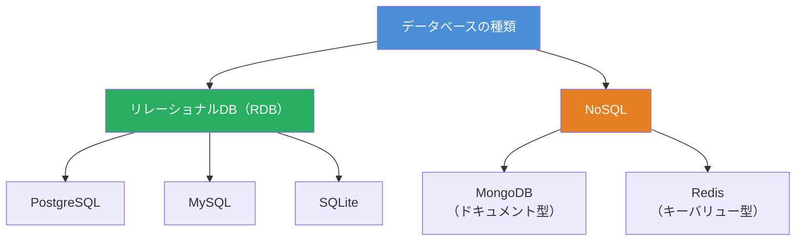
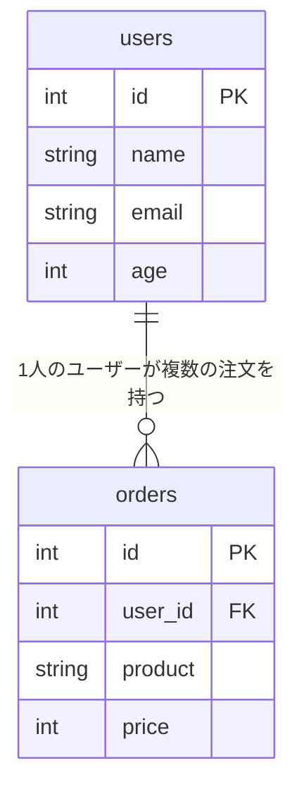
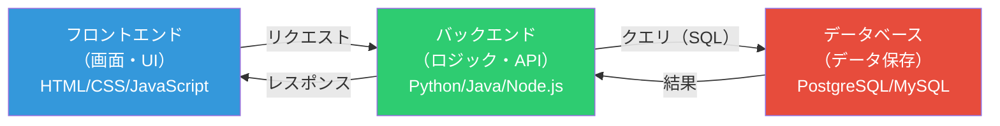

## はじめに

この記事では、データベースの基礎知識とシステム開発における役割を解説します。

**対象読者**: プログラミング初心者、非エンジニアでシステム開発に関わる人
**前提知識**: 特になし（ExcelやGoogleスプレッドシートを使ったことがあると理解しやすい）
**ゴール**: データベースとは何か、なぜ必要か、システム開発でどう使われるかを理解できる

**結論**: データベースは、アプリケーションのデータを安全かつ高速に管理するための仕組みです。Webアプリやスマホアプリなど、ほぼすべてのシステムの裏側で動いており、システム開発において最も重要な基盤の一つです。

## データベースとは何か

データベース（DB）とは、**大量のデータを整理して保存し、必要なときに素早く取り出せるようにした仕組み**です。

身近な例で考えると、Excelのスプレッドシートに近いイメージです。ただし、データベースにはExcelにはない重要な特徴があります。

| 比較項目 | Excel / スプレッドシート | データベース |
|---------|------------------------|-------------|
| データ量 | 数万行で動作が重くなる | 数億行でも高速に検索可能 |
| 同時編集 | 競合が起きやすい | 複数人が同時に安全に操作可能 |
| データの整合性 | 手動で管理 | 自動でルールを適用（制約） |
| 自動化 | マクロで対応 | プログラムから直接操作可能 |
| セキュリティ | ファイル単位のアクセス制御 | 行・列単位の細かいアクセス制御 |

つまり、データベースは「**大規模・高速・安全にデータを扱うための専用システム**」です。

## なぜデータベースが必要なのか

「ファイルにデータを保存すればよいのでは？」と思うかもしれません。小規模なデータならそれでも問題ありませんが、システム開発では以下の課題が発生します。

### 1. 同時アクセスの問題

ECサイトで100人が同時に商品を購入する場面を想像してください。ファイルに在庫数を記録していた場合、同時に読み書きすると「在庫10個なのに20個売れてしまう」といった矛盾が起きます。

データベースはこの問題を**トランザクション**という仕組みで解決します。「在庫を確認→減らす→注文を記録する」という一連の操作を、途中で他の処理が割り込めないようにまとめて実行します。

### 2. データの整合性

「ユーザーIDは必ず一意にする」「年齢にマイナスの値は入れない」といったルールを、データベースは**制約（Constraint）**として自動的に強制できます。ファイル保存では、こうしたルールをすべてプログラム側で管理する必要があります。

### 3. 検索速度

「東京都在住の30代ユーザーで、過去1ヶ月以内に購入履歴がある人」のような複雑な条件での検索を、データベースは**インデックス**という仕組みで高速に処理します。

## データベースの種類

データベースにはいくつかの種類がありますが、主に以下の2つを押さえておけば十分です。

### リレーショナルデータベース（RDB）

データを**テーブル（表）** の形で管理し、テーブル同士を関連づけて扱うデータベースです。現在最も広く使われています。

代表的な製品:
- **PostgreSQL** — オープンソースで高機能。2025年にバージョン18がリリースされ、性能が大幅向上
- **MySQL** — Webサービスで広く利用。WordPressなどの定番CMSでも採用
- **SQLite** — 軽量でサーバー不要。モバイルアプリや小規模システム向き

### NoSQL

RDBの表形式に縛られない柔軟なデータベースです。大量のデータを高速に処理したい場合や、データ構造が頻繁に変わる場合に適しています。

代表的な製品:
- **MongoDB** — JSON形式でデータを保存。スキーマの柔軟性が高い
- **Redis** — メモリ上でデータを管理し、超高速な読み書きが可能



## リレーショナルデータベースの基本構造

RDBの基本は**テーブル**です。Excelのシートと似ていますが、より厳密なルールがあります。

以下は「ユーザーテーブル」と「注文テーブル」の例です。

**usersテーブル（ユーザー情報）**

| id（主キー） | name | email | age |
|-------------|------|-------|-----|
| 1 | 田中太郎 | tanaka@example.com | 28 |
| 2 | 佐藤花子 | sato@example.com | 35 |
| 3 | 鈴木一郎 | suzuki@example.com | 42 |

**ordersテーブル（注文情報）**

| id（主キー） | user_id（外部キー） | product | price |
|-------------|-------------------|---------|-------|
| 101 | 1 | ノートPC | 120000 |
| 102 | 2 | キーボード | 15000 |
| 103 | 1 | マウス | 5000 |

ここで重要な用語を整理します。

- **テーブル**: データを格納する表。1つのテーブルが1つの「もの」を表す（ユーザー、注文、商品など）
- **行（レコード）**: テーブルの各行。1つのデータを表す（1人のユーザー、1件の注文など）
- **列（カラム）**: テーブルの各列。データの属性を表す（名前、メールアドレスなど）
- **主キー（Primary Key）**: 各行を一意に識別するための列。上の例では `id`
- **外部キー（Foreign Key）**: 別テーブルの主キーを参照する列。上の例では `user_id` がusersテーブルの `id` を参照している



この「テーブル同士の関連（リレーション）」がRDBの最大の特徴です。外部キーによって、「この注文は誰のものか」を正確にたどれます。

## SQLとは何か

SQL（Structured Query Language）は、データベースを操作するための言語です。データベースに対する操作は、大きく4種類（**CRUD**）に分類できます。

| 操作 | 英語 | SQL文 | 説明 |
|------|------|-------|------|
| 作成 | Create | `INSERT` | 新しいデータを追加する |
| 読取 | Read | `SELECT` | データを検索・取得する |
| 更新 | Update | `UPDATE` | 既存のデータを変更する |
| 削除 | Delete | `DELETE` | データを削除する |

それぞれの基本的な書き方を見てみます。

```sql
-- データの追加（Create）
INSERT INTO users (name, email, age) VALUES ('山田次郎', 'yamada@example.com', 25);

-- データの検索（Read）
SELECT name, email FROM users WHERE age >= 30;

-- データの更新（Update）
UPDATE users SET age = 29 WHERE id = 1;

-- データの削除（Delete）
DELETE FROM users WHERE id = 3;
```

:::message
SQLは英語の文章のように読めるのが特徴です。`SELECT name FROM users WHERE age >= 30` は「usersテーブルから、ageが30以上のnameを取得する」と読めます。
:::

## システム開発におけるデータベースの役割

Webアプリケーションやスマホアプリの多くは、以下の3層構造で動いています。



- **フロントエンド**: ユーザーが直接操作する画面（ブラウザやアプリ）
- **バックエンド**: ビジネスロジックやデータの加工を担当するサーバー側のプログラム
- **データベース**: すべてのデータを保存・管理する基盤

例えばSNSで「投稿を表示する」場合、以下のような流れになります。

1. ユーザーがタイムラインを開く（フロントエンド）
2. バックエンドに「最新の投稿を取得して」とリクエストが送られる
3. バックエンドがデータベースにSQL（`SELECT * FROM posts ORDER BY created_at DESC LIMIT 20`）を発行する
4. データベースが該当するデータを返す
5. バックエンドがデータを整形してフロントエンドに返す
6. フロントエンドが画面に投稿を表示する

データベースはこの構造の中で**データの永続化（保存）と取得を担う心臓部**です。データベースが停止すると、アプリケーション全体が機能しなくなります。

:::message alert
データベース設計の良し悪しは、システム全体の性能と保守性に直結します。後から変更するコストが非常に高いため、開発の初期段階で適切に設計することが重要です。
:::

## 2026年のデータベーストレンド

初心者の段階では詳しく知る必要はありませんが、データベースの世界で注目されている動きを紹介します。

### サーバーレスデータベース

従来のデータベースはサーバーの構築・運用が必要でしたが、**サーバーレスDB**はインフラ管理をクラウドに任せ、使った分だけ課金される仕組みです。

- **Neon** — サーバーレスPostgreSQL。使わないときはコストがゼロになる「スケール・トゥ・ゼロ」が特徴
- **Supabase** — PostgreSQLベースのBaaS（Backend as a Service）。認証やAPIも一体で提供

初心者にとっては**環境構築の手間がなくなる**という大きなメリットがあります。

### AI連携（ベクトルデータベース）

ChatGPTのようなAIアプリケーションでは、テキストや画像を「ベクトル（数値の配列）」に変換して検索する技術が使われています。PostgreSQLの拡張機能である**pgvector**を使えば、通常のRDBにベクトル検索機能を追加できます。

## 初心者がつまずきやすいポイント

データベースの学習で多くの初心者がつまずくポイントと、その対処法を紹介します。

| つまずきポイント | 対処法 |
|----------------|--------|
| 正規化が理解できない | まずは「同じデータを2箇所に書かない」というルールだけ覚える |
| JOINがわからない | ベン図で考える。まずはINNER JOINだけ使えれば十分 |
| 環境構築が難しい | SQLite（インストール不要）やSupabase（クラウド）から始める |
| データ型の選び方がわからない | 最初はINTEGER（数値）、TEXT（文字列）、DATE（日付）の3つでOK |

:::message
最初から完璧を目指す必要はありません。まずはSQLiteやブラウザで動くSQL学習サイトで`SELECT`文を書くことから始めると、データベースの基本が身につきます。
:::

## まとめ

- データベースは、大量のデータを安全・高速に管理するための仕組み
- 同時アクセス制御・データ整合性・高速検索など、ファイル保存にはない機能を持つ
- 主流はリレーショナルデータベース（RDB）で、テーブル間の関連でデータを管理する
- SQLという言語でデータのCRUD操作（作成・読取・更新・削除）を行う
- Webアプリの3層構造（フロントエンド↔バックエンド↔DB）の基盤として、システム開発に不可欠

## 参考リンク

- [PostgreSQL公式ドキュメント](https://www.postgresql.org/docs/)
- [SQL入門 — MDN Web Docs](https://developer.mozilla.org/ja/docs/Glossary/SQL)
- [Supabase公式サイト](https://supabase.com/)
