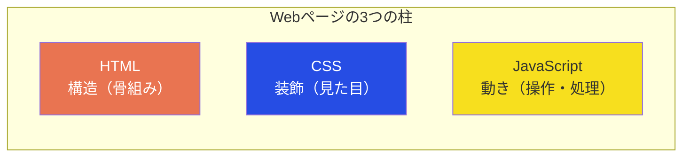
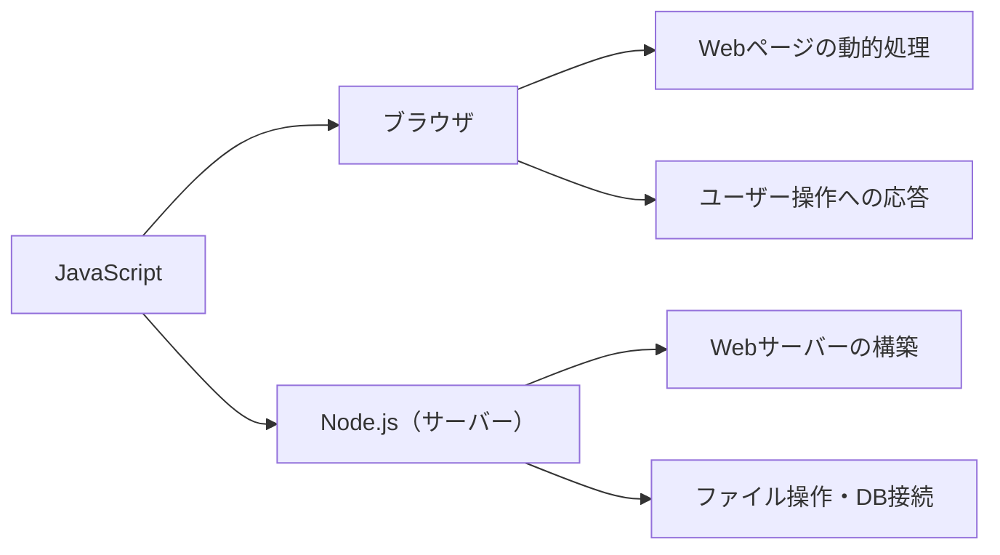

## はじめに

この記事では、プログラミング初心者に向けて「JavaScriptとは何か」「何ができるのか」「基本的な書き方」を解説します。

**対象読者**:
- プログラミング未経験〜学習を始めたばかりの方
- 「JavaScriptって名前は聞くけど、結局何なの？」という疑問を持っている方

**前提知識**: 不要（HTML/CSSの知識があるとなお理解しやすい）

**この記事のゴール**: JavaScriptの全体像と基本文法を理解し、自分の手でコードを動かせるようになる

## JavaScriptとは何か

JavaScriptは、**Webページに動きをつけるためのプログラミング言語**です。

HTMLが「ページの構造」、CSSが「見た目の装飾」を担当するのに対し、JavaScriptは「ユーザーの操作に応じた動的な処理」を担当します。ボタンをクリックしたら画面が変わる、フォームの入力内容をチェックする、データを取得して表示する――これらはすべてJavaScriptの仕事です。



### 生まれた経緯

JavaScriptは1995年、Netscape社のブレンダン・アイクによってわずか10日間で開発されました。当時はWebページに簡単な動きを加えるための「おまけ」のような言語でしたが、現在では世界で最も広く使われるプログラミング言語の1つに成長しています。

:::message
「Java」と「JavaScript」は名前が似ていますが、まったく別の言語です。当時のマーケティング上の理由で似た名前がつけられただけで、文法も設計思想も異なります。
:::

### どこで動くのか

JavaScriptが動く場所は大きく2つあります。



- **ブラウザ**: Chrome、Firefox、Safariなどのブラウザに組み込まれたJavaScriptエンジンで実行される。Webページの操作や表示の更新を担当する
- **Node.js**: ブラウザの外でJavaScriptを動かすための実行環境。サーバーサイドの処理やコマンドラインツールの開発に使われる

この記事では、ブラウザ上で動くJavaScriptに焦点を当てて解説します。

## 開発環境の準備

JavaScriptを試すのに特別なソフトは不要です。ブラウザさえあれば今すぐ始められます。

**手順（Google Chromeの場合）**:
1. Chromeを開く
2. `F12`キー（Macの場合は`Cmd + Option + I`）を押して開発者ツールを開く
3. 「Console」タブをクリックする
4. 入力欄にJavaScriptのコードを入力して`Enter`を押す

試しに、以下のコードを入力してみてください。

```javascript
console.log("Hello, JavaScript!");
```

`Hello, JavaScript!` と表示されれば成功です。`console.log()`は、指定した値をコンソールに出力する命令です。この記事に登場するコードはすべてこの方法で実行できます。

## 基本文法：変数とデータ型

### 変数とは

変数は、データに名前をつけて保存する仕組みです。JavaScriptでは`let`と`const`を使って変数を宣言します。

```javascript
let userName = "太郎";      // あとから変更できる
const maxScore = 100;       // あとから変更できない（定数）
```

- **`let`**: 値をあとから変更する可能性がある場合に使う
- **`const`**: 一度代入したら変更しない値に使う

基本的に**`const`を優先して使い、変更が必要な場合だけ`let`を使う**のが現在の標準的な書き方です。

### データ型

JavaScriptで扱う主なデータの種類は以下の通りです。

| データ型 | 説明 | 例 |
|---------|------|-----|
| 文字列（string） | テキストデータ | `"こんにちは"`, `'Hello'` |
| 数値（number） | 整数・小数 | `42`, `3.14` |
| 真偽値（boolean） | 真か偽か | `true`, `false` |
| 配列（Array） | 複数の値をまとめたリスト | `[1, 2, 3]` |
| オブジェクト（Object） | キーと値のペアの集まり | `{ name: "太郎", age: 20 }` |
| null / undefined | 値が存在しない / 未定義 | `null`, `undefined` |

```javascript
const greeting = "こんにちは";    // 文字列
const price = 1980;              // 数値
const isStudent = true;          // 真偽値
const colors = ["赤", "青", "緑"]; // 配列
const user = {                   // オブジェクト
  name: "太郎",
  age: 20
};

console.log(greeting);  // "こんにちは"
console.log(colors[0]); // "赤"（配列は0番目から数える）
console.log(user.name); // "太郎"
```

:::message
配列のインデックス（番号）は**0から始まる**点に注意してください。`colors[0]`が最初の要素、`colors[1]`が2番目の要素です。
:::

## 基本文法：条件分岐とループ

### 条件分岐（if / else）

条件によって処理を分けるには`if`文を使います。

```javascript
const score = 75;

if (score >= 80) {
  console.log("合格（優秀）");
} else if (score >= 60) {
  console.log("合格");
} else {
  console.log("不合格");
}
// 出力: "合格"
```

`score >= 80`のような式を**条件式**と呼び、結果は`true`か`false`になります。条件式が`true`のとき、その直後の`{ }`内の処理が実行されます。

### ループ（for）

同じ処理を繰り返すには`for`文を使います。

```javascript
const fruits = ["りんご", "バナナ", "みかん"];

for (let i = 0; i < fruits.length; i++) {
  console.log(fruits[i]);
}
// 出力:
// "りんご"
// "バナナ"
// "みかん"
```

`for`文の構造は以下の3つの部分で構成されます。

| 部分 | 意味 | 上の例 |
|------|------|--------|
| 初期化 | ループ変数の初期値を設定 | `let i = 0` |
| 条件 | この条件が`true`の間ループを続ける | `i < fruits.length` |
| 更新 | 1回のループが終わるたびに実行 | `i++`（iを1増やす） |

## 基本文法：関数

関数は、**一連の処理をまとめて名前をつけたもの**です。同じ処理を何度も書かずに済み、コードの見通しがよくなります。

### 関数宣言

```javascript
function greet(name) {
  return `こんにちは、${name}さん`;
}

console.log(greet("太郎")); // "こんにちは、太郎さん"
console.log(greet("花子")); // "こんにちは、花子さん"
```

- `name`は**引数**（関数に渡すデータ）
- `return`は**戻り値**（関数が返す結果）

:::message
`` `バッククォート` ``で囲んだ文字列を**テンプレートリテラル**と呼びます。`${変数名}`で変数の値を埋め込めるため、`+`で文字列をつなげるよりも読みやすく書けます。現在のJavaScriptではこちらが主流です。
:::

### アロー関数

同じ関数を、より短い書き方で定義できます。

```javascript
const greet = (name) => {
  return `こんにちは、${name}さん`;
};
```

処理が1行の場合は、さらに短く書けます。

```javascript
const greet = (name) => `こんにちは、${name}さん`;
```

アロー関数は現在のJavaScriptで頻繁に使われる書き方です。最初は`function`で書き方に慣れ、徐々にアロー関数に移行するとスムーズです。

## 初心者がつまずきやすい3つのポイント

### 1. `==`と`===`の違い

JavaScriptには比較演算子が2種類あります。

```javascript
console.log(1 == "1");   // true（型を変換してから比較）
console.log(1 === "1");  // false（型も含めて厳密に比較）
```

`==`は比較の前に型を自動変換するため、数値の`1`と文字列の`"1"`が等しいと判定されます。この挙動はバグの原因になりやすいため、**常に`===`（厳密等価演算子）を使う**ことを推奨します。

### 2. 暗黙の型変換

JavaScriptは型が異なる値同士の演算を自動で変換して処理します。これが予想外の結果を招くことがあります。

```javascript
console.log("5" + 3);    // "53"（文字列の結合になる）
console.log("5" - 3);    // 2（数値の引き算になる）
console.log(true + 1);   // 2（trueが1に変換される）
```

`+`演算子は文字列の結合にも使われるため、片方が文字列だと結合が優先されます。一方、`-`は数値演算にしか使われないため、文字列が数値に変換されます。

:::message alert
暗黙の型変換によるバグを防ぐには、`===`を使うことに加え、演算前に`Number()`や`String()`で明示的に型を変換する習慣をつけましょう。
:::

### 3. `var`を使わない理由

古いJavaScriptのコードや教材では`var`で変数を宣言しています。しかし、`var`にはスコープ（変数の有効範囲）に関する直感的でない挙動があるため、現在は**`let`と`const`を使うのが標準**です。

```javascript
// varの問題点：ブロックスコープが効かない
if (true) {
  var x = 10;
}
console.log(x); // 10（if文の外からアクセスできてしまう）

// letなら安全
if (true) {
  let y = 10;
}
console.log(y); // ReferenceError（if文の外からはアクセスできない）
```

古い教材で`var`を見かけた場合は、`let`または`const`に読み替えて問題ありません。

## JavaScriptで何ができるのか

JavaScriptの活用範囲は、Webページの動的処理にとどまりません。

| 分野 | 内容 | 代表的な技術 |
|------|------|-------------|
| フロントエンド | Webページのインタラクティブな機能 | React, Vue.js |
| バックエンド | Webサーバーの構築、API開発 | Node.js, Express |
| モバイルアプリ | iOS/Androidアプリの開発 | React Native |
| デスクトップアプリ | Windows/Mac向けアプリの開発 | Electron |
| ゲーム | ブラウザゲームの開発 | Phaser, Three.js |

1つの言語でこれだけ幅広い開発ができることが、JavaScriptの大きな強みです。まずはブラウザ上でのフロントエンド開発から始め、慣れてきたら他の領域にも挑戦できます。

## まとめ

この記事で学んだことを整理します。

- **JavaScriptとは**: Webページに動きをつけるプログラミング言語。ブラウザとNode.jsで動作する
- **変数**: `const`（定数）と`let`（変更可能）を使って宣言する。`var`は使わない
- **データ型**: 文字列、数値、真偽値、配列、オブジェクトが基本
- **条件分岐**: `if / else`で処理を分岐させる
- **ループ**: `for`文で同じ処理を繰り返す
- **関数**: 処理をまとめて再利用可能にする。アロー関数とテンプレートリテラルが現在の主流
- **注意点**: `===`を使う、暗黙の型変換に気をつける、`var`は避ける

### 次のステップ

基礎を理解したら、以下の順番で学習を進めるとスムーズです。

1. **DOM操作**: JavaScriptでHTMLの要素を操作する方法を学ぶ
2. **イベント処理**: クリック、入力などのユーザー操作に反応する方法を学ぶ
3. **非同期処理**: APIからデータを取得する`fetch`や`async/await`を理解する
4. **フレームワーク**: React、Vue.jsなどを使った本格的なWeb開発に挑戦する

## 参考リンク

- [MDN Web Docs - JavaScript](https://developer.mozilla.org/ja/docs/Web/JavaScript) — Mozilla公式のJavaScriptリファレンス
- [JavaScript Primer](https://jsprimer.net/) — JavaScriptの基礎を体系的に学べる日本語の無料教材
