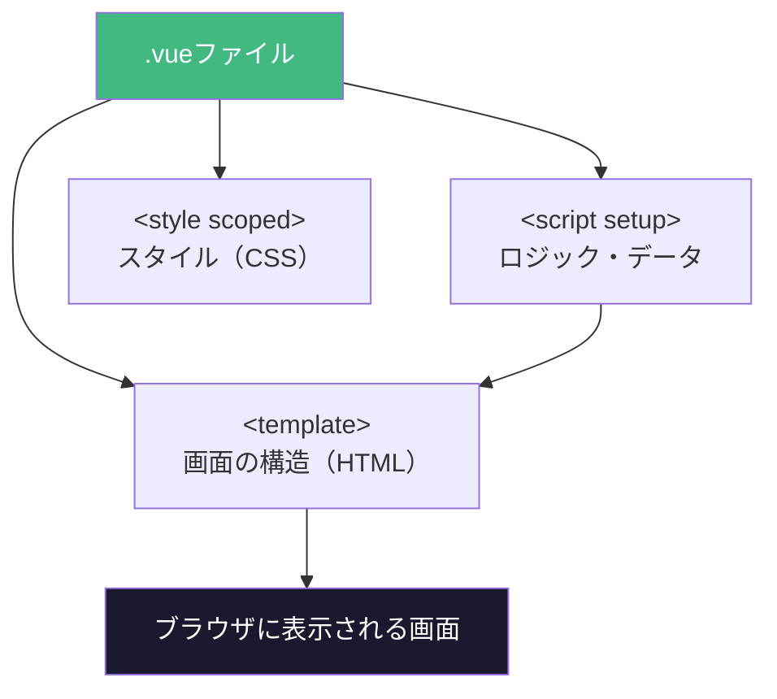
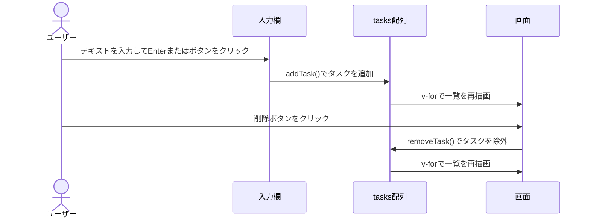

## はじめに

「Vueを勉強したいけど、何から始めればいいかわからない」
「公式ドキュメントを読んでも、いざコードを書こうとすると手が止まる」

そんな悩みを抱えたことはありませんか？

この記事では、AIコーディングアシスタント **Claude Code** と一緒にVue 3の開発をゼロから始める方法を紹介します。Claude Codeに質問しながら進めることで、**環境構築のつまずきを減らし、実際に動くアプリを短時間で作る**体験ができます。

:::message
この記事の対象読者
- HTML / CSS / JavaScriptを少し触ったことがある方
- Vueに興味はあるが、まだ書いたことがない方
- AI開発ツールを活用した学習に興味がある方
:::

この記事を読み終えると、以下ができるようになります：

- Claude Codeを使ったVue開発環境のセットアップ
- Vueコンポーネントの基本的な書き方
- シンプルなToDoアプリの完成

---

## Claude Codeとは？

Claude Codeは、Anthropicが開発したAIコーディングアシスタントです。ターミナル上で動作し、コードの生成・編集・説明をAIが行ってくれます。

初心者にうれしい理由は主に3つです。

**1. 自然な日本語で指示できる**
「Vueのコンポーネントを作って」「このエラーを直して」といった日本語の指示を理解して、コードを生成・修正してくれます。

**2. エラーの意味を説明してくれる**
見慣れないエラーメッセージが出ても、「このエラーはどういう意味？」と聞けばわかりやすく解説してくれます。

**3. 次のステップを提案してくれる**
「次は何をすればいい？」と聞くと、学習の流れを提案してくれるので、手が止まりにくくなります。

:::message alert
Claude Codeは有料プランが必要です。利用前に[公式サイト](https://claude.ai/claude-code)でご確認ください。
:::

---

## 環境構築

### 必要なもの

- Node.js 18 または 20（LTS推奨）（[公式サイト](https://nodejs.org/)からインストール）
- Claude Code（インストール済みであること）

### Vue 3プロジェクトの作成

ターミナルを開き、Claude Codeを起動します。

```bash
claude
```

Claude Codeに以下のように指示します。

```
Vite + Vue 3のプロジェクトをmy-vue-appという名前で作成して
```

Claude Codeが以下のコマンドを実行してくれます。

```bash
npm create vite@latest my-vue-app -- --template vue
cd my-vue-app
npm install
npm run dev
```

<!-- TODO: ターミナルの実行画面スクリーンショットを挿入 -->

ブラウザで `http://localhost:5173` を開くと、Viteのデフォルト画面が表示されます。

<!-- TODO: ブラウザのデフォルト画面スクリーンショットを挿入 -->

:::details プロジェクト構成の確認
作成されたプロジェクトの構成は以下のとおりです。

```
my-vue-app/
├── src/
│   ├── components/     # Vueコンポーネント置き場
│   ├── App.vue         # ルートコンポーネント
│   └── main.js         # エントリーポイント
├── public/
├── index.html
└── package.json
```

Claude Codeに「このファイル構成を説明して」と聞くと、各ファイルの役割を教えてくれます。
:::

---

## コンポーネント作成

Vueの基本単位は**コンポーネント**です。「部品」のようなもので、画面の一部を切り出して再利用できます。

Claude Codeに以下のように指示します。

```
src/components/に「こんにちは、Vue！」と表示するHelloMessage.vueコンポーネントを作って
```

すると、以下のようなファイルが生成されます。

```vue
<!-- src/components/HelloMessage.vue -->
<template>
  <div class="hello">
    <h2>{{ message }}</h2>
  </div>
</template>

<script setup>
const message = 'こんにちは、Vue！'
</script>

<style scoped>
.hello {
  color: #42b883;
  font-size: 1.5rem;
}
</style>
```

Vueコンポーネントは `<template>`（HTML）、`<script>`（ロジック）、`<style>`（スタイル）の3つのブロックで構成されています。



このコンポーネントを `App.vue` で使うには、Claude Codeに指示します。

```
App.vueにHelloMessageコンポーネントを組み込んで
```

<!-- TODO: ブラウザに「こんにちは、Vue！」が表示された画面スクリーンショットを挿入 -->

コンポーネントの基本が掴めたところで、次は複数の機能を組み合わせて実際のアプリを作ってみましょう。

---

## 実践：シンプルなToDoアプリを作る

ここまでの知識を活かして、ToDoリストアプリを作ります。Claude Codeにまとめて指示してみましょう。

```
src/components/TodoList.vueを作って。
機能は以下のとおり：
- テキスト入力欄とボタンでタスクを追加できる
- 追加したタスクが一覧表示される
- 各タスクに削除ボタンがある
```

生成されるコードの例です。

```vue
<!-- src/components/TodoList.vue -->
<template>
  <div class="todo-list">
    <h1>ToDoリスト</h1>
    <div class="input-area">
      <input
        v-model="newTask"
        @keyup.enter="addTask"
        placeholder="タスクを入力..."
        type="text"
      />
      <button @click="addTask">追加</button>
    </div>
    <ul>
      <li v-for="(task, index) in tasks" :key="index">
        <span>{{ task }}</span>
        <button @click="removeTask(index)">削除</button>
      </li>
    </ul>
  </div>
</template>

<script setup>
import { ref } from 'vue'

const newTask = ref('')
const tasks = ref([])

function addTask() {
  if (newTask.value.trim() === '') return
  tasks.value.push(newTask.value.trim())
  newTask.value = ''
}

function removeTask(index) {
  tasks.value = tasks.value.filter((_, i) => i !== index)
}
</script>

<style scoped>
.todo-list {
  max-width: 500px;
  margin: 2rem auto;
  padding: 1rem;
}
.input-area {
  display: flex;
  gap: 0.5rem;
  margin-bottom: 1rem;
}
input {
  flex: 1;
  padding: 0.5rem;
  font-size: 1rem;
}
button {
  padding: 0.5rem 1rem;
  cursor: pointer;
}
ul {
  list-style: none;
  padding: 0;
}
li {
  display: flex;
  justify-content: space-between;
  align-items: center;
  padding: 0.5rem 0;
  border-bottom: 1px solid #eee;
}
</style>
```

最後に `App.vue` にこのコンポーネントを追加するよう指示します。

```
App.vueにTodoListコンポーネントを組み込んで
```

<!-- TODO: 完成したToDoアプリのスクリーンショットを挿入 -->

アプリの動作フローは以下のとおりです。



:::message
コードの意味がわからない部分があれば、Claude Codeに「`v-model`って何？」「`ref`はなぜ使うの？」と聞いてみましょう。丁寧に説明してくれます。
:::

---

## まとめ・次のステップ

この記事では、Claude Codeを使ってVue 3の開発環境をセットアップし、シンプルなToDoアプリを作る手順を紹介しました。

**今回学んだこと**
- Vite + Vue 3の環境構築
- Vueコンポーネントの基本構造（template / script / style）
- `v-model`、`v-for`、`ref` といった基本的な機能

**次のステップ**

| テーマ | 説明 |
|-------|------|
| Vue Router | ページ遷移の実装 |
| Pinia | アプリ全体の状態管理 |
| Nuxt 3 | Vue製のフルスタックフレームワーク |
| TypeScript + Vue | 型安全なVue開発 |

Claude Codeに「次はVue Routerを学びたい、簡単なサンプルを作って」と伝えるだけで、次のステップに進めます。AIをうまく活用しながら、Vue開発を楽しんでみてください！
